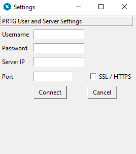
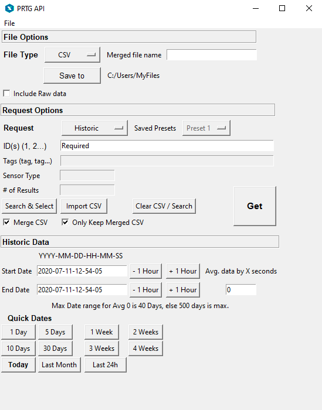
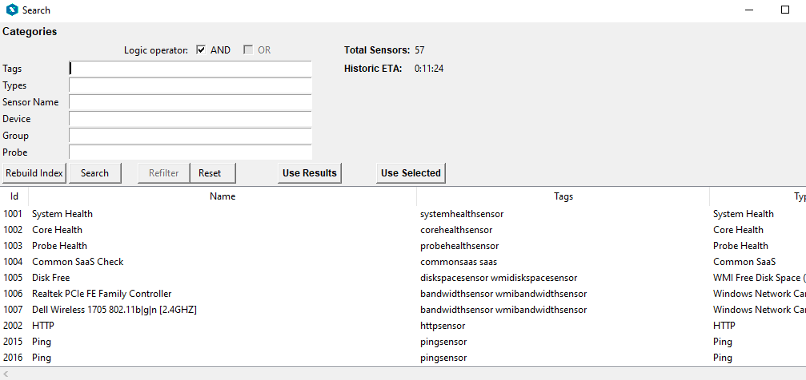

# **PRTG API Data Extractor**

Extract historical or live data from PRTG server, in either CSV, JSON or XML. 
Merges CSV's into single file for simple parsing. Import csv with IDs to 
retrieve or use built in Search functionality (tags, groups, type, sensor name,
 probe or device) to narrow down IDs.

---

## Requirements

    Python >= 3.6
    - Pandas
    - Numpy
    - Requests
    - Standard library

    - A PRTG Environment

##	Set Credentials

1. PRTG Admin username & password
2. PRTG Server IP
3. Add port
4. Check for SSL if necessary.  

##	General Steps

1. Select between Live Data or Historic Data
2. Input ID's, manually, import CSV or Search.
3. Set Date periods or specific live data request parameters.
4. Optionally set resulting file location (Default desktop)
5. **Get**

---

## Search

1. Empty returns all sensors
 

2. Search tags, name, type group or probe

3. Select specific rows or include all search results